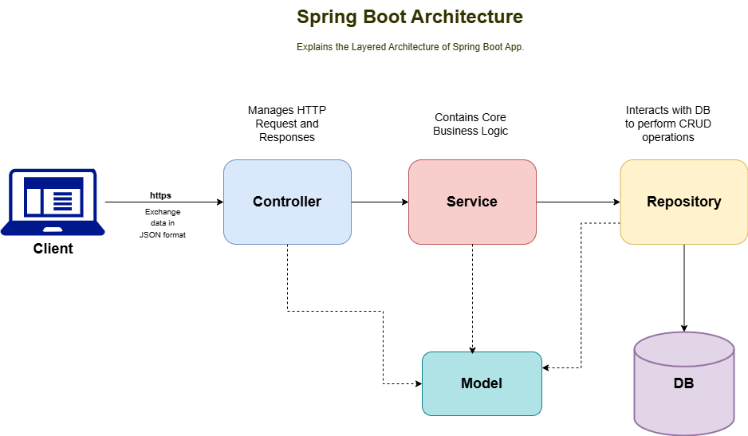

## Spring Boot Architecture

The architecture of a Spring Boot application typically follows a layered pattern, making it easy to maintain, test, and scale. 



The primary layers include:

### 1. **Model Layer (Domain Layer)**

- **Purpose:** Represents the data and business logic of the application. It contains POJOs (Plain Old Java Objects) that define the structure of the data being handled.
- **Components:** Entity classes, which are typically annotated with `@Entity`, represent database tables.
- **Example:**
    
    ```java
    @Entity
    public class Product {
        @Id
        @GeneratedValue(strategy = GenerationType.IDENTITY)
        private Long id;
        private String name;
        private String description;
        private double price;
        // Getters and Setters
    }
    
    ```
    

### 2. **Repository Layer (Data Access Layer)**

- **Purpose:** Interacts directly with the database to perform CRUD operations. It is responsible for managing data persistence.
- **Components:** Interfaces extending `JpaRepository` or `CrudRepository`. These provide methods like `save()`, `findAll()`, `findById()`, etc.
- **Annotations:** `@Repository` (though this annotation is optional when using Spring Data JPA).
- **Example:**
    
    ```java
    @Repository
    public interface ProductRepository extends JpaRepository<Product, Long> {
        // Custom query methods can be defined here
    }
    
    ```
    

### 3. **Service Layer (Business Logic Layer)**

- **Purpose:** Contains the core business logic. It is responsible for processing data between the controller and repository layers.
- **Components:** Classes annotated with `@Service` that handle business operations.
- **Best Practices:** Use the `@Transactional` annotation to manage transactions in this layer.
- **Example:**
    
    ```java
    @Service
    public class ProductService {
        @Autowired
        private ProductRepository productRepository;
    
        public List<Product> getAllProducts() {
            return productRepository.findAll();
        }
    
        public Product getProductById(Long id) {
            return productRepository.findById(id).orElse(null);
        }
    
        public Product saveProduct(Product product) {
            return productRepository.save(product);
        }
    }
    
    ```
    

### 4. **Controller Layer (Presentation Layer)**

- **Purpose:** Manages HTTP requests and responses. It handles incoming client requests, processes them with the help of the service layer, and returns the appropriate response (JSON, HTML, etc.).
- **Components:** Classes annotated with `@RestController` (for REST APIs) or `@Controller` (for web applications with view templates).
- **Annotations:** `@GetMapping`, `@PostMapping`, `@PutMapping`, `@DeleteMapping`, etc.
- **Example:**
    
    ```java
    @RestController
    @RequestMapping("/api/products")
    public class ProductController {
        @Autowired
        private ProductService productService;
    
        @GetMapping
        public List<Product> getAllProducts() {
            return productService.getAllProducts();
        }
    
        @GetMapping("/{id}")
        public Product getProductById(@PathVariable Long id) {
            return productService.getProductById(id);
        }
    
        @PostMapping
        public Product createProduct(@RequestBody Product product) {
            return productService.saveProduct(product);
        }
    }
    
    ```
    

### 5. **Other Layers (Optional)**

- **DTO Layer:** Data Transfer Objects are often used to encapsulate data sent between layers.
- **Utility Layer:** Contains utility classes for logging, date/time operations, etc.
- **Exception Handling Layer:** Handles exceptions and sends appropriate error responses to clients, usually with `@ControllerAdvice`.

### How These Layers Interact:

1. **Client Request:** A client sends an HTTP request to the controller.
2. **Controller:** The controller processes the request and forwards it to the service layer.
3. **Service:** The service layer contains the business logic. It interacts with the repository layer for data access.
4. **Repository:** The repository performs CRUD operations on the database and returns data to the service layer.
5. **Response:** The service layer sends the processed data back to the controller, which then returns it to the client.

### Key Benefits of This Architecture:

- **Separation of Concerns:** Each layer has a distinct responsibility, making the application easier to manage.
- **Scalability:** The architecture is easily scalable by adding more services or controllers without affecting the rest of the system.
- **Testability:** Each layer can be tested independently using unit and integration tests.

This layered approach is the foundation for building robust and maintainable applications in Spring Boot.