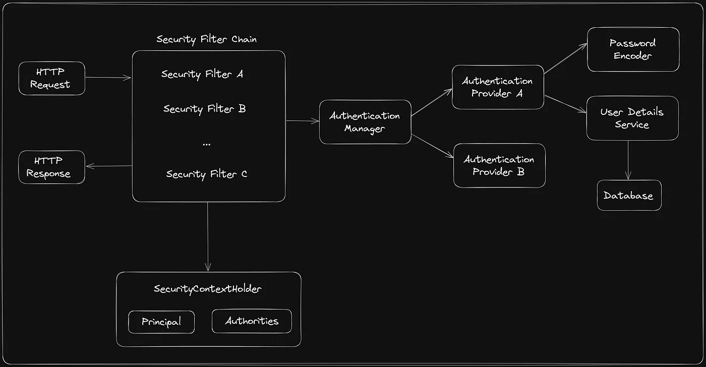

## **Spring Boot Security Overview**

Spring Boot Security is an extension of the Spring Security framework, which provides robust authentication, authorization, and protection against common security vulnerabilities in enterprise applications. It is built to be easily integrated into Spring Boot applications and offers default security configurations, minimizing the amount of boilerplate code required.

### Key Components of Spring Boot Security:

1. **Authentication**: Verifies the identity of users by checking their credentials (e.g., username and password). Spring Security supports various authentication methods, such as in-memory authentication, LDAP, OAuth2, JWT, and custom authentication providers.
2. **Authorization**: Determines what authenticated users are allowed to do within the application. This is typically handled by defining roles and permissions, which are then associated with specific URL patterns, methods, or objects.
3. **Filters**: These are the core building blocks in Spring Security. They process HTTP requests and perform various security checks before they reach the application. Filters in Spring Security are configured in a filter chain, where each filter has a specific responsibility.
4. **Security Context**: This holds the authentication information of the currently authenticated user. It is accessible throughout the application and is used to perform authorization checks.
5. **Security Configuration**: Spring Security provides default configurations, but it also allows developers to customize the security settings via `SecurityConfig` classes. These classes extend `WebSecurityConfigurerAdapter` or implement the `SecurityConfigurer` interface.

### Filters in Spring Security

Filters play a crucial role in the Spring Security architecture by intercepting and processing HTTP requests. The filter chain is processed in a specific order, with each filter having a distinct responsibility. Below are some key filters:

1. **SecurityContextPersistenceFilter**:
   - This filter is responsible for storing the `SecurityContext` (which contains the authentication details) in the `HttpSession` between requests. It ensures that the context is available for authorization checks in the subsequent filters.
2. **UsernamePasswordAuthenticationFilter**:
   - This filter handles the processing of username and password-based authentication. It retrieves the credentials from the login request, authenticates the user, and if successful, places the `Authentication` object in the `SecurityContext`.
3. **BasicAuthenticationFilter**:
   - This filter processes HTTP Basic Authentication headers. It extracts the credentials from the request header, authenticates them, and if valid, stores the authentication details in the `SecurityContext`.
4. **JwtAuthenticationFilter**:
   - If JWT (JSON Web Token) authentication is used, this filter validates the JWT token present in the request header and populates the `SecurityContext` with the user's authentication details.
5. **ExceptionTranslationFilter**:
   - This filter handles security exceptions thrown by any of the preceding filters. It converts exceptions into appropriate HTTP responses (e.g., 401 Unauthorized or 403 Forbidden).
6. **FilterSecurityInterceptor**:
   - This is the last filter in the chain and is responsible for making the final authorization decision. It checks if the authenticated user has the necessary permissions to access the requested resource.
7. **CsrfFilter**:
   - Protects against Cross-Site Request Forgery (CSRF) attacks by ensuring that every state-changing request includes a CSRF token.

### High-Level Architecture Diagram

The architecture diagram below illustrates the flow of an HTTP request through the Spring Security filter chain in a Spring Boot application:

### Steps of Request Processing:

1. **Client Request**: The user sends an HTTP request to the Spring Boot application.
2. **Security Filter Chain**: The request passes through the security filter chain, where each filter performs specific security-related tasks.
   - **Authentication Filters**: Authenticate the user and populate the `SecurityContext`.
   - **Authorization Filters**: Check the user’s permissions against the requested resource.
   - **CSRF Filter**: Ensures the request includes a valid CSRF token if required.
3. **Security Context**: The `SecurityContext` is used throughout the application to check the user's authentication and authorization status.
4. **Request Processing**: Once all security checks are passed, the request is processed by the application’s business logic.

### Summary

Spring Boot Security provides a comprehensive framework for securing applications, with filters playing a central role in processing authentication and authorization tasks. The filter chain ensures that every request undergoes multiple layers of security checks before reaching the application's core logic, making it a robust solution for securing web applications.
