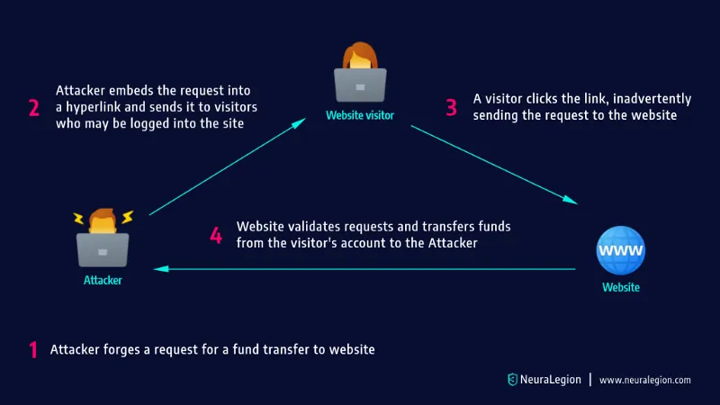

## Cross-Site Request Forgery (CSRF)

**Cross-Site Request Forgery (CSRF)** is a type of security attack where a malicious website tricks a user into performing actions on another website where they are already authenticated, without their consent. This can lead to unauthorized actions like changing user settings, making purchases, or even deleting accounts.

### Easy Explanation with an Example:

**Imagine the Scenario:**

1. **User Action on a Bank Website**:
    - You are logged into your online banking account in one browser tab.
    - You can perform actions like transferring money or changing account settings.
2. **Attacker’s Malicious Website**:
    - Meanwhile, you visit another website (perhaps a blog or a social media site) in a different tab or window.
    - Unknown to you, this site has malicious code embedded by an attacker.
3. **The CSRF Attack**:
    - The malicious website secretly sends a request to the bank's website to transfer money from your account to the attacker’s account.
    - Since you are already logged into your bank account, the bank’s website sees the request as coming from you (because your authentication cookies are still active).
    - The bank processes the request, thinking it’s legitimate.

**Result**: Money is transferred from your account without your knowledge, just because you visited the malicious website while logged into your bank account.



**Source**: NeuraLegion

### Key Points:

- **No Interaction Needed**: The attack doesn’t require you to click anything on the malicious site. Simply visiting the site is enough.
- **Exploits Trust**: CSRF exploits the trust that the bank’s website has in your browser session. Since you are logged in, the bank’s site assumes any request from your browser is legitimate.
- **Invisible to the User**: You don’t see the malicious request happening, so you may not even know you’ve been attacked until it’s too late.

### Example in Practice:

Let’s say the bank’s website has a URL for transferring money like this:

```
<https://www.mybank.com/transfer?amount=1000&toAccount=9876543210>

```

If the malicious website includes the following HTML code:

```html
" style="display:none">

```

When you visit the malicious website, your browser automatically sends the request to the bank, thinking it's loading an image. Since you’re already logged in to the bank in another tab, the bank processes the request, and the money is transferred.

### How to Protect Against CSRF:

1. **CSRF Tokens**:
    - Websites should include a unique token in forms that is required for any sensitive operation.
    - The token is sent with the request and verified by the server to ensure the request is genuine.
2. **SameSite Cookies**:
    - Cookies can be set with the `SameSite` attribute to prevent them from being sent along with requests initiated by third-party websites.
3. **Re-authentication**:
    - For very sensitive actions, websites may ask users to re-enter their password or use two-factor authentication to confirm their identity.

CSRF is dangerous because it can be carried out without the user's knowledge, making it a critical security concern for any web application handling sensitive information.
---

## Disabling CSRF protection

In Spring Security, CSRF protection is enabled by default because it is a significant safeguard against certain types of attacks. However, there are scenarios where CSRF protection might be unnecessary or even counterproductive, particularly in the context of certain web applications or APIs. In these cases, developers might disable CSRF protection using the code snippet:

```java
http.csrf(customizer -> customizer.disable());

```

### Reasons to Disable CSRF in Spring Security

1. **Stateless APIs**:
    - **No Session Management**: CSRF protection is primarily designed for web applications that manage sessions using cookies. Since most RESTful APIs are stateless and do not use sessions or cookies, they are not vulnerable to CSRF attacks in the same way traditional web applications are.
    - **Token-Based Authentication**: APIs that use token-based authentication methods (such as JWT) include the authentication token in the headers of the request rather than relying on cookies. Since these tokens are not automatically sent by the browser like cookies, the risk of CSRF is significantly reduced, making CSRF protection unnecessary.
2. **Simplifying Development for Non-Web Applications**:
    - **Mobile Apps**: If your application is primarily accessed via mobile apps or other clients that do not rely on cookies or the same-origin policy, CSRF protection may not be needed. Disabling it can simplify the development process.
    - **Third-Party Integrations**: In some cases, you may need to expose endpoints to third-party services that do not support CSRF tokens. Disabling CSRF protection can be necessary to ensure compatibility.
3. **Custom Security Mechanisms**:
    - **Alternative Security Measures**: Some applications implement custom security mechanisms that make CSRF protection redundant. For example, if all requests are validated against a different form of authentication (like OAuth2 or API keys), CSRF protection might not add additional security.
4. **Single Page Applications (SPAs)**:
    - **JavaScript Frameworks**: Many modern SPAs use JavaScript frameworks like Angular, React, or Vue.js to handle authentication through mechanisms like JWTs or OAuth tokens. These frameworks often do not rely on traditional form submissions, making CSRF protection unnecessary for these requests.

### When **Not** to Disable CSRF:

Disabling CSRF should be done with caution and only when you are sure that the application does not need this layer of protection. If your application relies on cookies for session management and serves a web interface, it is usually safer to keep CSRF protection enabled to prevent attacks.

### Conclusion:

Disabling CSRF in Spring Security is appropriate in stateless applications, APIs, or scenarios where alternative security measures are in place. However, understanding the security implications is crucial to ensure that disabling CSRF does not expose your application to potential vulnerabilities.