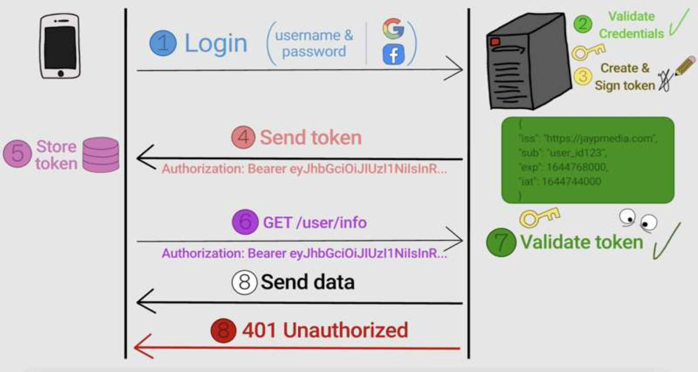

## JWT Token Authorization

**What is JWT?**

JWT (JSON Web Token) is an open standard (RFC 7519) used to securely transmit information between a client (like a browser) and a server. JWTs are commonly used for **authentication** and **authorization** in modern web applications.

---

### **1. What is JWT Made Of?**

A **JWT** has three parts, separated by dots (`.`):

```
HEADER.PAYLOAD.SIGNATURE

```

Each part is Base64Url-encoded.

### **1.1. Header**

The header contains the type of token and the hashing algorithm used (like HMAC SHA256 or RSA).

```json
{
  "alg": "HS256",
  "typ": "JWT"
}
```

### **1.2. Payload**

The payload contains **claims**, which are statements about the user (like user ID, role, or other information).

```json
{
  "sub": "1234567890",
  "name": "Mohammed Aeraf",
  "role": "admin",
  "iat": 1680256732, // Issued at timestamp
  "exp": 1680856732 // Expiration timestamp
}
```

### **1.3. Signature**

The signature ensures the token has not been tampered with. It is created using a secret key (or a private key) and the header + payload.

```
HMACSHA256(
  base64UrlEncode(header) + "." +
  base64UrlEncode(payload),
  secret
)

```

---

### **2. JWT Authorization Flow**

Here is the **step-by-step process** for JWT-based authorization.

### **Step 1: User Login**

1. The user sends their **username and password** to the server (via login API).
2. The server validates the user's credentials.

### **Step 2: Token Generation**

1. If the credentials are valid, the server generates a **JWT token**.
2. The token contains the user's information (like `userId`, `role`, etc.) in the payload.
3. The server signs the token using a **secret key**.

### **Step 3: Token Sent to Client**

1. The JWT token is sent back to the client as part of the response.
2. The client stores this token (commonly in **localStorage**, **sessionStorage**, or **HTTP cookies**).

### **Step 4: Accessing Protected Resources**

1. When the client requests a protected resource (like an API), it sends the **JWT token** in the `Authorization` header.

   ```
   Authorization: Bearer <JWT_TOKEN>

   ```

2. The server verifies the token (using the secret key).
3. If the token is valid, the user is granted access to the requested resource.

---

### **3. Detailed Diagram of JWT Authorization Flow**

---



### **4. Example of JWT Implementation in Spring Boot (Code Example)**

Here is a simple implementation of JWT-based authentication in **Spring Boot**.

### **Step 1: Add Maven Dependencies**

Add the following dependencies in `pom.xml`.

```xml
<dependency>
    <groupId>io.jsonwebtoken</groupId>
    <artifactId>jjwt</artifactId>
    <version>0.9.1</version>
</dependency>

```

---

### **Step 2: JWT Utility Class**

This class is used to **generate** and **validate** the JWT tokens.

```java
import io.jsonwebtoken.Claims;
import io.jsonwebtoken.Jwts;
import io.jsonwebtoken.SignatureAlgorithm;
import org.springframework.stereotype.Component;

import java.util.Date;

@Component
public class JwtUtil {
    private String secret = "mysecretkey"; // Secret key (Should be stored securely)

    // Generate JWT token
    public String generateToken(String username) {
        return Jwts.builder()
                .setSubject(username)
                .setIssuedAt(new Date())
                .setExpiration(new Date(System.currentTimeMillis() + 1000 * 60 * 60 * 10)) // 10 hours
                .signWith(SignatureAlgorithm.HS256, secret)
                .compact();
    }

    // Validate JWT token
    public Boolean validateToken(String token, String username) {
        final String tokenUsername = extractUsername(token);
        return (tokenUsername.equals(username) && !isTokenExpired(token));
    }

    // Extract username from JWT
    public String extractUsername(String token) {
        return extractAllClaims(token).getSubject();
    }

    // Check if the token is expired
    public Boolean isTokenExpired(String token) {
        return extractAllClaims(token).getExpiration().before(new Date());
    }

    // Extract all claims from the token
    private Claims extractAllClaims(String token) {
        return Jwts.parser().setSigningKey(secret).parseClaimsJws(token).getBody();
    }
}

```

---

### **Step 3: Controller with Login and Protected Endpoint**

```java
import org.springframework.beans.factory.annotation.Autowired;
import org.springframework.web.bind.annotation.*;

@RestController
@RequestMapping("/api")
public class AuthController {

    @Autowired
    private JwtUtil jwtUtil;

    // Login endpoint
    @PostMapping("/login")
    public String login(@RequestBody User user) {
        if ("user".equals(user.getUsername()) && "password".equals(user.getPassword())) {
            return jwtUtil.generateToken(user.getUsername());
        } else {
            throw new RuntimeException("Invalid credentials");
        }
    }

    // Protected endpoint (requires JWT)
    @GetMapping("/protected")
    public String getProtectedResource(@RequestHeader("Authorization") String token) {
        String tokenWithoutBearer = token.substring(7); // Remove 'Bearer ' from the header
        if (jwtUtil.validateToken(tokenWithoutBearer, "user")) {
            return "You have access to the protected resource!";
        } else {
            return "Invalid token!";
        }
    }
}

```

---

### **5. Key Security Concepts in JWT**

| **Concept**      | **Explanation**                                                                        |
| ---------------- | -------------------------------------------------------------------------------------- |
| **Expiration**   | JWTs have an expiration (`exp` claim) to prevent infinite token usage.                 |
| **Signature**    | The signature ensures the token is not tampered with. If modified, verification fails. |
| **Bearer Token** | The token is sent in the `Authorization: Bearer <JWT>` header.                         |
| **Secret Key**   | The server uses a secret key to sign the JWT. The key must be **secure**.              |
| **Stateless**    | The server does not store session data for users, as everything is in the JWT.         |

---

### **6. Common JWT Mistakes to Avoid**

1. **Not Using Token Expiration**: Tokens without expiration can be stolen and used indefinitely.
2. **Storing JWT in LocalStorage**: Tokens stored in `localStorage` can be stolen by XSS attacks. It’s better to store tokens in **HTTP-only cookies**.
3. **Leaking the Secret Key**: The secret key should be kept secret, ideally using **environment variables**.
4. **Reusing the Same Secret Key**: Use different keys for production and development.
5. **Not Validating the Token**: Always validate the token (expiration, signature) before giving access.

---

### **Summary of JWT**

| **Feature**   | **Description**                        |
| ------------- | -------------------------------------- |
| **Type**      | Stateless (server doesn’t track users) |
| **Structure** | Header, Payload, Signature             |
| **Used For**  | Authentication & Authorization         |
| **Security**  | Signature validation + expiration      |
| **Usage**     | Sent as Bearer token in HTTP header    |

---
